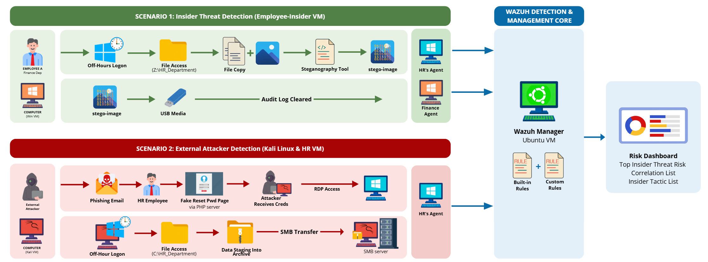

# Insider Threat Simulation and Detection System

KAUST Academy Cybersecurity Training project. A simulated corporate
network generating both normal and malicious insider activity, monitored
end-to-end with Wazuh, using a mix of built-in and custom detection rules.

**Team:** Ghaida, Abrar, Shjoon

## Architecture



Two Windows endpoint agents report to one Wazuh manager:

- **Employee-Insider** — plays "Employee A, Finance Dept" in Scenario 1
- **Employee-Normal** — plays "HR Employee" in Scenario 2

A Kali Linux VM acts as the external attacker in Scenario 2.

## Scenario 1 — Insider Threat (Employee-Insider)

Six-stage escalating-employee narrative: off-hours access, access
outside job role, mass file copy, steganography, USB media, log
tampering.

## Scenario 2 — External Attacker via Stolen Credentials (Employee-Normal)

An attacker uses phished credentials to RDP in, stage sensitive HR
files, and exfiltrate them over SMB to a Kali-hosted listener.

## Rule reference

| Rule ID | Scenario / Stage | Trigger | MITRE |
|---|---|---|---|
| 100103–104 | S1 Stage 1 (Off-hours access) | Off-hours / weekend login | — (timing condition on a login event, not a distinct technique) |
| 554, 550, 553 (built-in FIM) | S1 Stage 2 (Access outside job role) | File access outside role, scoped to the Restricted HR directory | T1485, T1565.001 |
| 100105 | S1 Stage 3 (Mass file copy) | Mass file copy (FIM frequency match) | T1074 |
| 100020 | S1 Stage 4 (Steganography) | Steganography (image entropy) | T1027.003 |
| 100021 | S1 Stage 5 (USB / removable media) | USB storage connected | T1092 |
| 63103–63104 | S1 Stage 6 (Log tampering, built-in) | Log cleared | T1070.001 |
| 100026 | S2 | RDP logon from attacker-net IP | T1021.001 |
| 100027 | S2 | Explicit-credential logon (net use) | T1078 |
| 100028 | S2 | Outbound SMB connection to attacker | T1048.002 |

## Repo layout

```
rules/       local_rules.xml — all custom detection rules
config/      per-agent syscheck blocks (FIM configuration)
simulation/  exact commands used to trigger each scenario
dashboard/   stretch-goal risk-scoring dashboard (React + Python)
docs/        architecture diagram
```

## Setup

1. Install Wazuh manager + indexer + dashboard (Ubuntu 24.04.4 LTS).
2. Enroll Windows agents, named `Employee-Insider` and `Employee-Normal`.
3. Copy `rules/local_rules.xml` to `/var/ossec/etc/rules/` on the manager,
   then `sudo systemctl restart wazuh-manager`.
4. On each agent, add the corresponding block from `config/` to that
   agent's own `ossec.conf` `<syscheck>` section, then restart the agent.
5. Run the commands in `simulation/` to reproduce each scenario.

